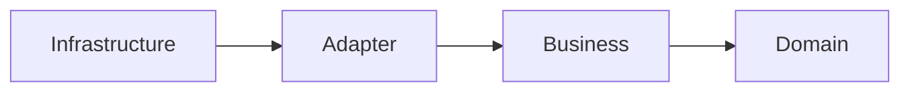

# <center>Clean Architecture Template</center>


## Spanish
### Qué es Arquitectura Limpia?
Primero destacar que "Clean Architecture" no es una arquitectura fija, es decir, puede tener algunas diferencias dependiendo de lo que el negocio necesite.

**La regla de oro de esta arquitectura consiste en que las capas externas son las mas propensas a cambios, por ende las que interactuan con el exterior al negocio.**

**A medida que nos acercamos a la capa mas interna, estas deben ser menos propensas a cambios, con la finalidad de proteger el negocio central del proyecto.**

### Por qué utilizar arquitectura limpia?
La arquitectura limpia tiene el proposito de abstraer nuestro negocio de factores externos como el UI, Base de datos, Web servers, etc.

Esto permite que el corazón de nuestra aplicación sólo se concentre en su propio negocio. Esto con el objetivo de poder **testear** nuestras reglas de negocio mas facilmente y sin depender de elementos anexos.

El **testing** nos ayuda a probar el código, y que este al recibir un cambio, siga realizando su trabajo correctamente. Esto nos ayuda a que las correcciones de código disminuyan el riesgo de corromper el funcionamiento de la aplicación y por consecuencia a aumentar la calidad de nuestro producto.

Al lograr, que nuestro projecto sea agnostico al exterior, nos permite cambiar cualquiera de estos factores sin modificar nuestro negocio, es decir, un cambio de UI, base de datos, servicios, entre otros, solo afectará la capa de comunicación a estos (**Infrastructure**), y será transparente para el resto.

### Regla de dependencias
La dependencia de capas es siempre hacia adentro, por lo que la capa mas interna no puede depender de ninguna otra.

Las capas utilizadas en este template son:
- Infrastructure
- Adapter
- Business
- Domain

Siendo "Domain" nuestra capa central.




Para conocer más sobre esta arquitectura puedes ingresar [aquí](https://blog.cleancoder.com/uncle-bob/2012/08/13/the-clean-architecture.html).


### Template de capas
Este template presenta la siguiente estructura.

```
src/
├── domain/
│   ├── entities/
│   ├── repositories/
├── business/
│   ├── use_cases/
│   └── services/
├── adapters/
│   ├── controllers/
│   ├── dtos/
│   ├── presenters/
│   └── mappers/
└── infrastructure/
    ├── database/
    ├── http/
    └── restApi/
```

### Flujo de información

#### Infrastructure
Capa mas externa de la arquitectura se compone de integraciones y herramientas. Como por ejemplo bases de datos, web frameworks, etc.

#### Adapters
Capa de transformación de datos, es la encargada de preparar los datos para que estos ingresen a la capa de negocio y/o para ser mostrados por la capa de `Infrastructure`.

Los `controllers` y `presenters` cumplen roles distintos, pero ambos tienen la función de actuar como intermediarios entre las capas externas (como la interfaz de usuario o los servicios externos) y las capas internas (la lógica de negocio y dominio)

##### Controller
El controller tiene el propósito principal de recibir las solicitudes (requests) desde el mundo exterior, ya sea de una API, una interfaz de usuario o una aplicación de consola. Los controllers están más ligados a la entrada de datos en la aplicación y son responsables de:

- Recibir y manejar las solicitudes entrantes.
- Validar los datos que recibe.
- Convertir las solicitudes en comandos o datos que los use cases (casos de uso) puedan entender.
- Llamar al caso de uso apropiado para procesar la lógica de negocio.

**Responsabilidades clave del controller:**
- Entrada de datos: Recoge los datos del usuario o de una API.
- Validación: Puede validar o preparar los datos antes de pasarlos al caso de uso.
- Lógica mínima: No debe haber lógica de negocio compleja en el controller.
- Llamada al caso de uso: Su trabajo principal es delegar la lógica a un caso de uso.

Ejemplo:
```javascript
// src/interface-adapters/controllers/DataController.ts
import { GetExternalData } from "../../application/use-cases/GetExternalData";
import { Logger } from "../../infrastructure/logger/Logger";

export class DataController {
  constructor(private getExternalData: GetExternalData, private logger: Logger) {}

  async showData() {
    try {
      const data = await this.getExternalData.execute();
      this.logger.log("Data fetched successfully");
      // Aquí llamaría al presenter para preparar la respuesta si fuera necesario
      console.log(data); // Muestra el resultado directamente
    } catch (error) {
      this.logger.error("Failed to fetch data", error);
    }
  }
}

```
En este caso, el DataController toma la entrada (aunque sea mínima en una aplicación de consola), llama al caso de uso correspondiente y maneja los errores. Si fuera una API REST, este controller se ocuparía de recibir una solicitud HTTP y luego invocar el caso de uso.

##### Presenter
El presenter es el encargado de preparar la salida o la respuesta que la aplicación presentará al usuario o al sistema exterior. Este rol está más enfocado en formatear y transformar los datos obtenidos del caso de uso para que se ajusten al formato que espera la vista (frontend) o un cliente externo.


**Responsabilidades clave del presenter:**

- Transformación de datos: Toma los datos crudos desde el caso de uso y los convierte en el formato que el cliente o vista espera. Esto puede incluir formatear fechas, cambiar estructuras, o aplicar máscaras de seguridad a los datos.
- Preparación para la salida: Prepara los datos para ser enviados a la capa de presentación, ya sea una API, una interfaz gráfica, o un archivo en la consola.
- Sin lógica de negocio: Al igual que el controller, el presenter no debe contener lógica de negocio, solo se ocupa de formatear los datos para su presentación.

Ejemplo
```javascript
// src/interface-adapters/presenters/DataPresenter.ts
import { BusinessDataModel } from "../../domain/models/BusinessDataModel";

export class DataPresenter {
  static present(data: BusinessDataModel[]): string {
    return data.map(item => `Title: ${item.title}, Description: ${item.description}`).join("\n");
  }
}
```
En este caso, el DataController toma la entrada (aunque sea mínima en una aplicación de consola), llama al caso de uso correspondiente y maneja los errores. Si fuera una API REST, este controller se ocuparía de recibir una solicitud HTTP y luego invocar el caso de uso.

#### Business
Capa que concentra las reglas de negocio necesarias para la aplicación. En esta sólo se concentra negocio del sistema, es agnostica a quien utiliza su negocio.

`A esta capa se le realizan la mayoria de los test, debido a que los casos de uso concentran el negocio de la aplicación, y es este el que se debe comprobar que funcione correctamente.`

#### Domain
Capa de dominio, es la capa mas interna, la cual esta menos suceptibles a cambios en todo el sistema.
En esta capa se encuentran las entidades de negocio, aquellas entidades que son estrictamente parte del negocio de la aplicación y que no tienen relación a nada más que no sea el propio negocio.
También maneja las interfaces de los repositorios, para "Enserñar" los métodos por los cuales se interactuarán con el negocio del sistema.
